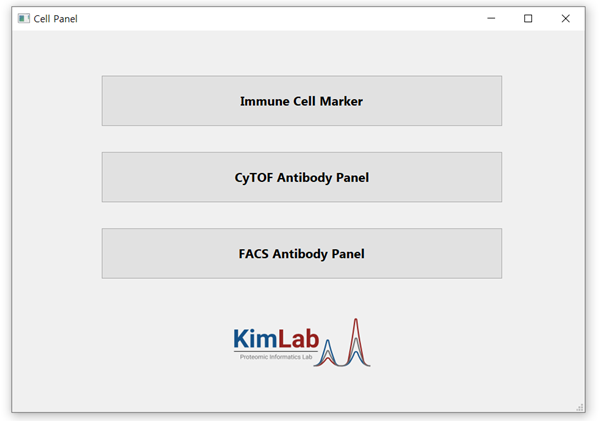

# ImapDB (Immune and panel DataBase)
This repository contains the source code for ImapDB, an immune research GUI written in PyQt, pandas, and openpyxl. ImapDB aims to serve as a guide for immune cell research, providing curated immune markers and antibody panels for FACS and CyTOF. 

### Components are tested on:
-	Windows, macOS & Linux
-	Python 3.9 and above
-	PyQt5 5.11 and above
-	Pandas 2.2.2
-	Openpyxl 3.1.5

  
  
    

## ScreenShot
 The program's interface consists of three buttons on the main window: Immune Cell Marker, CyTOF Antibody Panel, and FACS Antibody Panel. When each button is clicked, a dialog box appears that provides information related to the button's name. Within the dialog box, users can select from the listed marker and antibody panel information in the combo box of the dialog and perform a search. 

  
 

  

## Before Running the program

To run the program without errors, the installation of the aforementioned essential libraries is required.

#### Pyqt5
    pip install pyqt5
    pip install pyqt5-tools
    
#### Pandas
    pip install Pandas
    
#### openpyxl
    pip install openpyxl

  

### File paths in Python
Modify the path of the designated input files (listed below) on the personal computer in the code.
-	Several Excel files
-	Several .ui files
-	Logo .jpg file

 

    form_home = uic.loadUiType("Intro_Real_fin.ui")[0]

    form_immune = uic.loadUiType("Immune_Dialog.ui")[0]

    form_CyTOF = uic.loadUiType("CyTOF_Dialog.ui")[0]
    
    form_FACS = uic.loadUiType("FACS_Dialog.ui")[0]

You can update the paths of other files by using Ctrl+F to find 'C:/Users/DELL/Desktop/Python/' and modifying it according to your working environment.

 

## Source of Input files
The references for immune markers of surface and intracellular can be found in the supplementary data of the manuscript slated for publication. (Not yet published.)